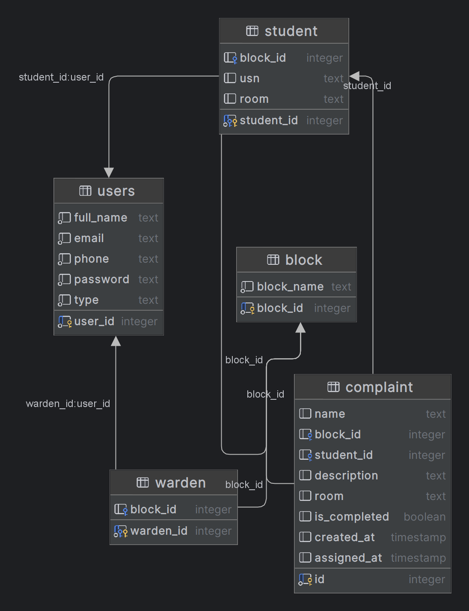

# Intelligent Hostel Complaint Management System

## 1. Overview

The Intelligent Hostel Complaint Management System is a full stack web application designed to provide a digital, transparent, and efficient way for students to register hostel-related complaints and for wardens/administrators to manage and resolve them in real time. The system eliminates manual complaint handling and introduces secure, role-based, and automated grievance redressal.

---

## 2. Key Features

1. Secure student and warden login using JWT authentication  
2. Online complaint submission by students  
3. Real-time complaint status tracking  
4. Dedicated student dashboard  
5. Dedicated warden dashboard  
6. Complaint resolution and status update by wardens  
7. Complaint history and transparency  
8. Fully responsive modern user interface  
9. Automated database initialization  

---

## 3. Technology Stack

Frontend  
React.js  
Tailwind CSS  

Backend  
Node.js  
Express.js  

Database  
PostgreSQL  

Authentication & Security  
JWT (JSON Web Token)  
Role-based access control  

Tools & Utilities  
Git & GitHub  
VS Code  
Docker (future scope)  

---

## 4. Application Screenshots

Login Page  
.png)

Signup Page  
.png)

Student Dashboard  
.png)

Student Profile Information  
.png)

Student Submitting Complaint  
.png)

Student Dashboard After Submitting Complaint  
.png)

Warden Dashboard  
.png)

Warden Resolves Complaint  
.png)

Student Dashboard Updated  
.png)

Database Schema Diagram  


---

## 5. Project Setup Guide (For All Team Members)

This section explains how any team member can run the project locally without creating any database or tables manually.

### 5.1 Prerequisites

Install the following software:

1. Node.js (version 18 or above recommended)  
2. npm  
3. PostgreSQL  
4. Git  
5. optional:pgAdmin (only for viewing database tables)  

Note: You do NOT need to manually create any database or tables. The backend automatically creates all required tables on first run.

---

### 5.2 Clone the Repository

```bash
git clone https://github.com/venkateswarlugoud/Intelligent-Hostel-Complaint-Management-System.git
cd Intelligent-Hostel-Complaint-Management-System


---

5.3 Backend Setup

Step 1: Navigate to backend folder

cd backend

Step 2: Install backend dependencies

npm install

Step 3: Create environment file

There is a template file named .env.example.
Create a new file named .env in the same backend folder and add your PostgreSQL credentials:

DB_HOST=localhost
DB_PORT=5432
DB_NAME=postgres
DB_USER=postgres
DB_PASSWORD=your_postgres_password

Note: Each team member must use their own PostgreSQL password. This file is ignored by Git and is not shared.

Step 4: Start the backend server

node server.js

If everything is correct, the terminal will show:

✅ Database tables are ready  
✅ Application is running on port 3000

At this stage, all required database tables are created automatically.


---

5.4 Frontend Setup

Step 1: Open a new terminal
Step 2: Navigate to frontend folder

cd frontend

Step 3: Install frontend dependencies

npm install

Step 4: Start the frontend application

npm run dev

Step 5: Open the application in browser
Usually available at:

http://localhost:5173


---

5.5 First-Time Usage Instructions

1. Open the web application.


2. Create a new account using the Signup page.


3. Register as a Student.


4. Login using the same credentials.


5. Navigate to the complaint submission page.


6. Submit your first complaint.


---

5.6 If Complaint Submission Is Not Working

If complaint submission does not work and backend shows:

Cannot destructure property 'student_id' of 'userInfo' as it is undefined

It means that the student record is missing in the student table.

To fix:

Step 1: Open pgAdmin
Step 2: Connect to PostgreSQL
Step 3: Select the postgres database
Step 4: Open Query Tool
Step 5: Find your user ID

SELECT * FROM users;

Step 6: Insert matching record into student table

INSERT INTO student (student_id, block_id, usn, room)
VALUES (3, 34, '22XXXXXXX', 101)
ON CONFLICT (student_id) DO NOTHING;

Replace 3 with your actual user_id.


---

6. Contribution Guidelines

1. All team members must work on separate branches.


2. Do not push directly to the main branch.


3. All changes must be submitted through pull requests.


4. Code must be tested before merging.


---

7. Future Scope

1. Migration of backend to Python FastAPI


2. AI-based complaint categorization


3. Technician and maintenance staff module


4. SMS and Email notifications


5. Advanced analytics and performance reports


6. Cloud deployment


---

8. License

This project is developed for academic and educational purposes.
